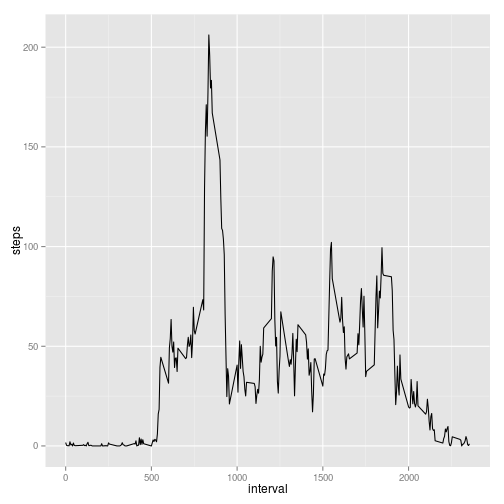

Reproducible Research: Peer Assessment 1
-----------------------------------------

### Loading and preprocessing the data


```r
rm(list=ls())
data<- read.csv("activity.csv", colClasses = c("numeric", "Date", "numeric"))
Sys.setlocale("LC_TIME", "C")
```

```
## [1] "C"
```

```r
head(data, 3)
```

```
##   steps       date interval
## 1    NA 2012-10-01        0
## 2    NA 2012-10-01        5
## 3    NA 2012-10-01       10
```

### What is mean total number of steps taken per day?

**Make a histogram of the total number of steps taken each day**


```r
datasum<- aggregate(steps~date, data = data, sum, na.rm = T)
hist(datasum$steps, col = 5,
     main = "Total steps taken per day",
     xlab = "Steps")
rug(datasum$steps)
```

 

### Calculate and report the mean and median total number of steps taken per day

**Mean**

```r
mean(datasum$steps) 
```

```
## [1] 10766
```

**Median**

```r
median(datasum$steps)
```

```
## [1] 10765
```

### Make a time series plot (i.e. type = "l") of the 5-minute interval (x-axis) and the average number of steps taken, averaged across all days (y-axis)


```r
library(ggplot2)
z<- aggregate(steps~interval, data = data, mean)
qplot(interval, steps, data = z, geom = "line")
```

 

### Which 5-minute interval, on average across all the days in the dataset, contains the maximum number of steps?

```r
which.max(z$steps)
```

```
## [1] 104
```

```r
z$interval[which.max(z$steps)]
```

```
## [1] 835
```

###Imputing missing values

**Calculate and report the total number of missing values in the dataset**

```r
sum(is.na(data$steps))
```

```
## [1] 2304
```

###Devise a strategy for filling in all of the missing values in the dataset

**I replace NA`s whith the mean value of steps**

```r
dataNa<- data
dataNa[is.na(dataNa)] <- mean(dataNa$steps, na.rm=TRUE)
head(dataNa)
```

```
##   steps       date interval
## 1 37.38 2012-10-01        0
## 2 37.38 2012-10-01        5
## 3 37.38 2012-10-01       10
## 4 37.38 2012-10-01       15
## 5 37.38 2012-10-01       20
## 6 37.38 2012-10-01       25
```
Create a new dataset that is equal to the original dataset but with the
missing data filled in.

```r
str(dataNa)
```

```
## 'data.frame':	17568 obs. of  3 variables:
##  $ steps   : num  37.4 37.4 37.4 37.4 37.4 ...
##  $ date    : Date, format: "2012-10-01" "2012-10-01" ...
##  $ interval: num  0 5 10 15 20 25 30 35 40 45 ...
```

**Make a histogram of the total number of steps taken each day and Calculate**
**and report the mean and median total number of steps taken per day.**

```r
dataNaz<- aggregate(steps~date, data = dataNa, sum)
ggplot(dataNaz, aes(x = steps)) + 
        geom_histogram(fill = "green", colour = "black") +
        geom_vline(xintercept = mean(dataNaz$steps),
                   color = "red", linetype = "dashed", size = 1)
```

```
## stat_bin: binwidth defaulted to range/30. Use 'binwidth = x' to adjust this.
```

 

**Total number of steps taken per day.**


```r
mean(dataNaz$steps)
```

```
## [1] 10766
```

```r
median(dataNaz$steps)
```

```
## [1] 10766
```

### Are there differences in activity patterns between weekdays and weekends?

Create a new factor variable in the dataset with two levels – “weekday”
and “weekend” indicating whether a given date is a weekday or weekend
day.

```r
dataNazWeekend<- as.factor(ifelse(weekdays(dataNaz$date) %in% c("Saturday", "Sunday"), "Weekday", "Weekends"))
a<- cbind(dataNa, dataNazWeekend)
```

Make a panel plot containing a time series plot (i.e. type = "l") of the
5-minute interval (x-axis) and the average number of steps taken, averaged
across all weekday days or weekend days (y-axis).


```r
ggplot(a, aes(x = interval, y = steps)) + 
        geom_bar(stat = "identity") + 
        facet_grid(. ~dataNazWeekend)
```

 


